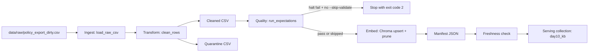

# Pipeline Architecture - Lab Day 10

**Group:** Day10-Y6-Multi-agent  
**Updated:** 2026-04-15

---

## 1. End-to-end flow

Freshness is measured at publish time from `latest_exported_at` in manifest. `run_id` is generated per run and propagated to logs, metadata, and manifest.

---

## 2. Responsibility boundaries

| Component | Input | Output | Group owner |
|----------|-------|--------|-------------|
| Ingest | `data/raw/policy_export_dirty.csv` | in-memory raw rows | Ingestion Owner |
| Transform | raw rows | cleaned rows + quarantine rows + 2 CSV artifacts | Cleaning/Quality Owner |
| Quality | cleaned rows | expectation results + halt signal | Cleaning/Quality Owner |
| Embed | cleaned CSV + env config | Chroma collection snapshot (`day10_kb`) | Embed Owner |
| Monitor | manifest JSON | freshness `PASS/WARN/FAIL` | Monitoring/Docs Owner |

---

## 3. Idempotency and rerun behavior

- Embed uses deterministic `chunk_id` and Chroma `upsert`, so reruns do not duplicate vectors for unchanged chunks.
- Pipeline prunes IDs that are no longer present in current cleaned snapshot, preventing stale vectors from remaining in top-k retrieval.
- Re-running `python etl_pipeline.py run --run-id <new-id>` updates serving state while preserving full observability via per-run logs and manifests.

---

## 4. Day 09 integration

- Day 10 produces and maintains the trusted retrieval layer used by Day 09 agents.
- We keep a separate collection name (`day10_kb`) so data quality experiments (inject/corruption) do not contaminate Day 09 baseline collection.
- Shared domain corpus is still aligned (`policy_refund_v4`, `sla_p1_2026`, `it_helpdesk_faq`, `hr_leave_policy`) to keep question coverage consistent across days.

---

## 5. Known risks

- Contract is not enforced by a schema validator library yet (manual/code-level checks only).
- Freshness currently relies on manifest timestamps, not source system watermarks.
- Quality checks are keyword/rule based; semantic drift may still pass unless additional eval slices are added.
